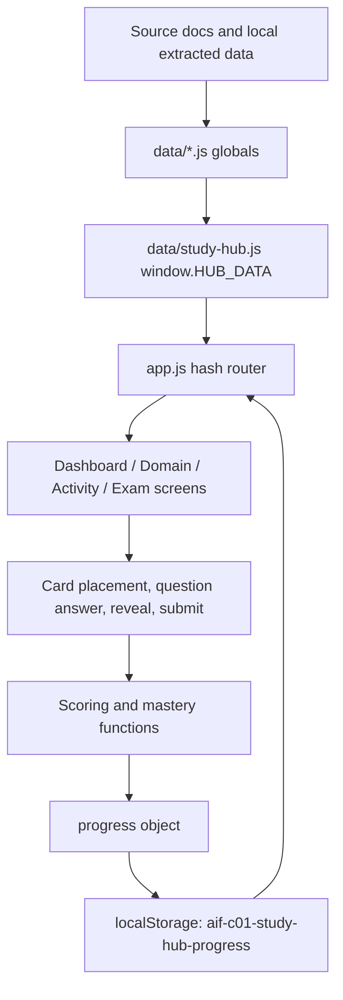

# AI Practitioner Study Hub Technical Handoff

Audit date: 2026-08-25  
Repository root: `/Users/camilaarocamunoz/Desktop/AI Practitioner Study Platform`  
Allowed scope: inspection/documentation only. No application source files were modified.

## 1. Executive Overview

**Verified.** This repository is a static, client-side AWS Certified AI Practitioner AIF-C01 study hub. It consolidates study-guide-derived card activities, migrated standalone HTML games, Domain 1 reinforcement units, a D omain 1 simulated exam, and a newer final exam center into one routed browser application.

The learner journey is:

1. Open the dashboard at `index.html#/home`.
2. Choose a domain, an exact task/subtask, a card-set round, a reinforcement unit, or the Exam Center.
3. Practice by placing cards into slots, restoring source tables, answering true/false statements, completing guided reinforcement questions, reviewing question-bank items, or taking a timed simulated exam.
4. Receive feedback after checking or submitting.
5. Master a card round only by answering every card correctly without using Reveal during that attempt.
6. Return to weak areas, recently completed activities, objective remediation links, or another exam attempt.

Main screens:

| Screen | Route | Purpose |
|---|---:|---|
| Dashboard | `#/home` | Overall activity status, domain cards, exam center shortcuts, weak areas, recently completed work. |
| Domain page | `#/domain/{number}` | Domain overview, guide hierarchy browser, grouped activities, Domain 1 reinforcement units. |
| Card activity | `#/activity/{activityId}` or `#/activity/{activityId}/{roundId}` | Shared card engine for match/sort/order/matrix/true-false rounds. |
| Domain 2 addendum overview | `#/addendum/domain2` | Specialized overview for Domain 2 gap-filling addendum sets. |
| Reinforcement unit | `#/activity/{reinforcementId}` | Four-stage review, guided examples, immediate practice, mastery checkpoint. |
| Domain 1 simulated exam | `#/activity/domain1-simulated-exam` | Older 60-question Domain 1-only exam using `DOMAIN1_QUESTIONS`. |
| Exam Center | `#/exam-center` | Newer final bank and 65-question full exam using `CYU_QUESTION_BANK`. |
| Question Bank | `#/question-bank...` | One-question-at-a-time practice by all/domain/objective/missed/unseen/mixed. |
| Full Simulated Exam | `#/full-exam...` | 65-question, 90-minute, all-domain randomized exam. |

**Verified.** The app is fully static and browser-only. It uses no server backend, no external APIs, no package-managed framework, and no network calls beyond loading local static files. Learner state persists in `localStorage`.

## 2. Technology Stack And Execution

| Area | Verified finding |
|---|---|
| Framework | None. Vanilla HTML/CSS/JavaScript. |
| Language | Browser JavaScript, HTML, CSS. No TypeScript. |
| Build system | None discovered. |
| Package manager | None discovered; no `package.json`. |
| Routing | Manual hash routing in `app.js` via `location.hash` and `hashchange`. |
| Styling | Plain CSS in `styles.css`; CSS custom properties in `:root`. |
| Icons | Text glyphs only: sidebar expand glyphs and check mark. No icon library. |
| Fonts | System font stacks plus local serif stack. No external font loading. |
| Animations | CSS transitions on cards/slots/buttons; reduced-motion media query present. |
| State management | Module-level JavaScript variables plus serialized `localStorage`. |
| Persistence | `localStorage` key `aif-c01-study-hub-progress`; legacy migration from `aif-c01-domain1-card-match-progress-v1`. |
| Test/validation | Node validation scripts. No unit-test framework discovered. |
| Lint/format/typecheck | No lint/formatter/typecheck config discovered. `node --check app.js` is used for syntax. |
| External services | None. |
| Hosting/deployment | No deployment config discovered. Can open `index.html` directly or serve with Python HTTP server per README. |

Supported commands:

| Purpose | Command | Source/status |
|---|---|---|
| Install dependencies | None | No dependencies or package manifest. |
| Open directly | Open `index.html` in browser | README-supported. |
| Start local server | `python3 -m http.server 8080` | README-supported; server started in audit environment with approval. |
| App URL | `http://127.0.0.1:8080/index.html#/home` | README-supported; fetch verification was blocked by environment networking. |
| Production build | None | Static files only. |
| Preview production build | Same as static server/direct open | No separate build. |
| Required validation | `node validate-data.js` | Passed. |
| Required validation | `node validate-hub.js` | Passed. |
| Required validation | `node validate-exam.js` | Passed. |
| Required syntax check | `node --check app.js` | Passed. |
| Additional validation | `node validate-exam-center.js` | Passed. |
| Additional validation | `node validate-sidebar-nav.js` | Passed. |
| Additional validation | `node validate-domains345.js` | Passed. |
| Additional validation | `node validate-guide-hierarchy.js` | Passed. |
| Additional focused validators | `node validate-domain2-addendum.js`, `node validate-fm-lifecycle.js`, `node validate-kb-capability-match.js`, `node validate-customization-use-when.js`, `node validate-vector-store-table.js`, `node validate-inference-parameters.js`, `node validate-agent-workflow-match.js`, `node validate-rag-query-order.js` | Passed. |

## 3. Repository Map

```text
.
├── AGENTS.md
├── README.md
├── index.html
├── styles.css
├── app.js
├── AWS_AI_Practitioner_Study_Guide.docx
├── AIF-C01_Domain_2_Gap_Filling_Addendum(2).docx
├── Data.png
├── data/
│   ├── study-hub.js
│   ├── domain1.js
│   ├── legacy-activities.js
│   ├── guide-hierarchy.js
│   ├── domain2-addendum.js
│   ├── domains345.js
│   ├── exams/
│   │   ├── domain1-exam-config.js
│   │   └── domain1-question-bank.js
│   ├── exam-center/
│   │   ├── cyu-question-bank.js
│   │   └── supplemental-approved-question-bank.js
│   └── reinforcement/
│       └── domain1-reinforcement.js
├── legacy/
│   ├── MIGRATION.md
│   ├── genai-fundamentals-matching-game.html
│   ├── lifecycle-matching-game.html
│   ├── metrics-matching-game.html
│   ├── mlops-matching-game.html
│   └── pipeline-services-matching-game.html
├── scripts/
│   └── extract-cyu-bank.py
├── validate-*.js
├── question-audit.md
└── question-sources.md
```

Responsibilities:

| Path | Responsibility |
|---|---|
| `AGENTS.md` | Repository rules: source of truth, structure, progress/mastery rules, validation checklist, accessibility requirements. |
| `README.md` | Static app overview, local serving instructions, progress key, validation commands. |
| `index.html` | Single HTML shell; top bar, sidebar, main region, footer, and ordered script loading. |
| `styles.css` | Entire visual system, responsive layout, activity states, exam styles, accessibility helpers. |
| `app.js` | Hash router, dashboard/domain/addendum/activity/exam renderers, shared card engine, progress service, exam scoring. |
| `data/study-hub.js` | Central registry. Creates `window.HUB_DATA` from domain metadata and all activity collections. |
| `data/domain1.js` | Original Domain 1 Task 1.1/1.2 data and expansions. |
| `data/legacy-activities.js` | Extracted migrated activities from original standalone HTML games. |
| `data/guide-hierarchy.js` | Domain/task/subtask hierarchy, subtask titles, annotation helpers, Domain 1 and Domain 2 expansions. |
| `data/domain2-addendum.js` | Domain 2 addendum activity, specialized groups, matrix/true-false/sequence/match factories. |
| `data/domains345.js` | Domain 3-5 source-structure games and card factories. |
| `data/exams/domain1-exam-config.js` | 60-question Domain 1 simulated exam blueprint. |
| `data/exams/domain1-question-bank.js` | Domain 1 simulated exam bank. |
| `data/exam-center/cyu-question-bank.js` | 215-question all-domain CYU master bank. |
| `data/exam-center/supplemental-approved-question-bank.js` | Supplemental approved bank merged into final center validation. |
| `data/reinforcement/domain1-reinforcement.js` | Domain 1 adaptive reinforcement units and checkpoint questions. |
| `legacy/` | Original standalone games kept as reference, not loaded by `index.html`. |
| `validate-*.js` | Read-only data integrity and source-structure validators. |
| `scripts/extract-cyu-bank.py` | Extraction utility for CYU bank generation. |

## 4. Application Architecture And Data Flow

**Verified.** Startup is script-order driven. `index.html` loads data globals first, then `data/study-hub.js` builds `window.HUB_DATA`, then `app.js` reads those globals and renders into `#app`.

Architecture:

1. `index.html` creates static shell: top bar, `#sidebar`, `#app`.
2. Data scripts attach globals to `window`.
3. `data/study-hub.js` builds domain metadata and activity registry.
4. `app.js` loads/migrates progress from `localStorage`.
5. `route()` interprets `location.hash`.
6. Render functions create DOM using `innerHTML` and event listeners.
7. Activity checks/submissions update the in-memory `progress` object.
8. `saveProgress()` writes the whole object back to `localStorage`.



Activities are mostly data-driven. The shared `hub-card-engine` normalizes three data shapes:

| Shape | Trigger | Used for |
|---|---|---|
| New cards/destinations | `round.cards && round.destinations` | Domain 1 expansions, Domain 2 addendum, Domain 3-5 source games. |
| Legacy buckets | `round.mode === "buckets"` | Sort scenarios into many-card buckets. |
| Legacy concepts | `round.concepts` plus optional `slotTypes` | Match one or more generated cards per concept. |

Special modules bypass the card engine:

| Module | Renderer |
|---|---|
| `domain1-reinforcement-unit` | `renderReinforcementUnit()` |
| `domain1-simulated-exam` | `renderDomain1Exam()` |
| Exam Center routes | `renderExamCenter()`, `renderQuestionBank()`, `renderFullExam()` |

## 5. Complete Screen And Navigation Inventory

| Screen/state | Route/activation | Purpose/actions | Mobile behavior | Implementation |
|---|---|---|---|---|
| Top bar | Always visible | Menu toggle, title, reset progress. Reset uses `confirm()`. | Menu button appears at `max-width:720px`; sidebar becomes fixed drawer. | `index.html`, `app.js` reset/menu listeners, `styles.css`. |
| Sidebar | Always rendered by route | Home, Domain 1-5 hierarchy, Domain 2 addendum, Exam Center. Expand/collapse tasks/subtasks. | Hidden by default; toggled with Menu. | `renderSidebar()`, `makeSidebarHierarchy()`, `makeAddendumSidebar()`. |
| Dashboard | `#/home` or empty hash | Continue, weak areas, domain cards, Exam Center cards, recent completions. | Cards stack by responsive grids. | `renderHome()`. |
| Domain page | `#/domain/1` through `#/domain/5` | Domain summary, guide hierarchy, grouped activities. Domain 1 adds reinforcement area. | Details/cards become single-column. | `renderDomain()`, `renderGuideHierarchy()`. |
| Guide hierarchy browser | On domain pages | Browse task/subtask/card-set links, launch targeted rounds. | Summary/header layouts become block; text wraps aggressively. | `renderGuideTask()`, `renderGuideSubtask()`, `renderGuideCardSet()`. |
| Domain 2 addendum overview | `#/addendum/domain2` | Progress summary, objective badges, grouped suggested study order. | Same responsive card/list behavior. | `renderDomain2Addendum()`. |
| Card activity shell | `#/activity/{id}/{round?}` | Previous/next, round tabs, loose card bank, board, check/shuffle/clear/reveal. | Round tabs horizontally scroll; bank gets max height; matrix tables collapse to stacked cells. | `renderActivity()`, `renderRoundBoard()`. |
| Matrix board | Card round with `layout:"matrix"` | Place table cells into row/column intersections. | Table becomes stacked; column label shown via `::before`. | `renderMatrixBoard()`, CSS `.source-matrix`. |
| True/false board | Card round with `layout:"true-false"` | Select true/false, check/reveal. No loose bank. | List remains stacked. | `renderTrueFalseBoard()`, `checkTrueFalse()`. |
| Reinforcement unit | `#/activity/domain1-inference`, etc. | Rapid review, guided examples, practice, checkpoint, repeat. | Grids collapse to one column. | `renderReinforcementUnit()`. |
| Reinforcement checkpoint | Inside reinforcement unit | Start/restart, one question at a time, retry behavior for immediate-feedback units. | Same as cards/forms. | `renderCheckpoint()`, `advanceCheckpoint()`. |
| Exam Center | `#/exam-center` | Open bank, start full exam, inspect bank/domain/type/latest stats. | Cards stack. | `renderExamCenter()`. |
| Question Bank home | `#/question-bank` | Review all/missed/unseen/mixed 30; browse by domain/objective. | Activity cards stack. | `renderQuestionBankHome()`. |
| Question Bank session | `#/question-bank/filter/{kind}`, `#/question-bank/domain/{n}`, `#/question-bank/objective/{id}` | One question at a time, check/update, previous/next. Feedback after check. | Form rows stack naturally. | `renderQuestionBankSession()`. |
| Full Exam start | `#/full-exam` or `#/full-exam/start` | Start 65-question timed exam, review latest result, see sampling plan. | Responsive cards. | `renderFullExamStart()`. |
| Full Exam active | `#/full-exam` with active attempt | Timer, question nav, answer, flag, prev/next, finish. | Nav grid compresses; actions wrap. | `renderFullExamQuestion()`. |
| Full Exam results | `#/full-exam/result/{id}` | Score, diagnostics, remediation, patterns, full review. | Lists stack. | `renderFullExamResults()`. |
| Domain 1 Simulated Exam start/active/results | `#/activity/domain1-simulated-exam` | Older Domain 1-only 60-question timed/untimed exam. | Question nav moves from side to top. | `renderDomain1Exam()` and related functions. |

Sidebar hierarchy:

- Home.
- For each domain in `HUB_DATA.domains`: a Domain link.
- If `guideHierarchy` has the domain, render task sections, subtask sections, and card-set links.
- Task/subtask toggles are buttons with `aria-expanded`/`aria-controls`; text link beside each toggle navigates to the first available set in that group.
- Each card-set link displays card count and a check mark when the round is mastered.
- Domain 2 additionally inserts an Addendum section after the Domain 2 group.
- Exam Center link appears after domains.

## 6. Learning Activity Inventory

Implemented modes:

| Mode/name in repo | Data/route | Mechanics |
|---|---|---|
| Card matching | `hub-card-engine` rounds with one-card slots | Place one card in each destination slot. |
| Sorting/buckets | `activity:"sort"` or `mode:"buckets"` | Many cards can be placed in each category. |
| Ordering | Card rounds whose destinations are ordered positions | Learner restores sequence by placing cards in numbered slots. |
| Matrix/table completion | `layout:"matrix"` | Learner restores removed cells into visible row/column table. |
| True/false | `layout:"true-false"` | Learner selects True or False per statement. |
| Reinforcement rapid review | Domain 1 units | Read comparison table, clues, traps, mini-comparisons. |
| Reinforcement guided examples | Domain 1 units | Scenario cards explain clue, answer, alternative failure. |
| Reinforcement active practice | Domain 1 units | MCQ/MRQ with immediate feedback after each submit. |
| Reinforcement mastery checkpoint | Domain 1 units | One-question-at-a-time checkpoint; mastery at 85% by default. |
| Question Bank practice | CYU bank | MCQ/MRQ/ordering/matching; feedback after check. |
| Full Simulated Exam | CYU bank | 65 timed questions, no feedback until submission. |
| Domain 1 Simulated Exam | Domain 1 bank | 60 timed or untimed questions, no feedback until submission. |

Shared card-engine sequence:

1. Route selects activity/round.
2. `normalizeRound()` adapts source data.
3. Cards are shuffled with Fisher-Yates.
4. Learner clicks a card then a slot, drags card to slot, or uses Enter/Space on focused slot after holding a card.
5. Check marks correct/wrong placements and saves progress.
6. Reveal moves answers into place or selects true/false values, sets `revealed`, and prevents mastery for that attempt.
7. Clear resets board state and, when user invoked, clears `revealedThisAttempt` for the next attempt.
8. Perfect check without reveal records mastery and shows next-step actions.

Representative trace:

- `data/domain1.js` round `d1-t11-vocab-1` defines destination `{id:"ai", label:"Artificial intelligence"}` and card `{id:"c-ai", text:"The broad field...", answer:"ai"}`.
- `data/guide-hierarchy.js` annotates the round with hierarchy metadata.
- `data/study-hub.js` puts the round into activity `domain1-task11-12`.
- `app.js` route `#/activity/domain1-task11-12/d1-t11-vocab-1` calls `renderActivity()`.
- `normalizeRound()` preserves `answer:"ai"` as `answers:["ai"]`.
- `makeDestination()` creates a slot with `data-expects="ai"`.
- `makeCard()` creates the loose card button.
- `checkAnswers()` compares `card.answers` with `slot.dataset.expects`.
- `roundProgress("domain1-task11-12","d1-t11-vocab-1")` is updated in `localStorage`.

Activity details:

| Activity type | Attempts | Feedback timing | Reveal | Completion/mastery | Accessibility/mobile |
|---|---:|---|---|---|---|
| Card match/sort/order/matrix | Unlimited | On Check; per-slot marks and verdict. | Available anytime; prevents mastery for that attempt. | Mastered only if all cards correct without Reveal. | Cards are buttons; slots focusable role buttons; click-to-place and drag/drop; matrix stacks on mobile. |
| True/false | Unlimited | On Check; item border/state plus reason text. | Selects all correct answers, shows reasons, prevents mastery. | Mastered only if all statements correct without Reveal. | Buttons inside radiogroup-like container; source uses buttons not actual radios. |
| Reinforcement practice | Unlimited updates per item | Immediate after Submit/Update. | No reveal control; feedback shows correct answer after submitted. | Practice alone does not set mastery. | Native radios/checkboxes in labels. |
| Reinforcement checkpoint | Unlimited restarts/repeats | Immediate for most units; mixed checkpoint delays complete review until first pass done. | No reveal. | First-pass percent >= `masteryPercent` (85 by default) sets mastery. | Native form controls. |
| Question Bank | Unlimited session updates | After Check; checking once records history, updating does not re-count result. | Correct answer shown after checking. | Updates question history only; not activity mastery. | Native controls/selects. |
| Full Exam | Unlimited attempts, last 10 retained | Only after submit/timeout. | No reveal during active attempt. | Readiness target is 80%; no activity master roll-up currently tied to dashboard. | Native controls, buttons, timer aria-live. |
| Domain 1 Simulated Exam | Unlimited attempts, last 10 retained | Only after submit/timeout. | No reveal during active attempt. | Percent >= 70 sets mastered for activity. | Native controls, question navigator buttons, timer warnings announced at 10/5 minutes. |

## 7. Card Match And Card-Set System

**Verified counts.** The hierarchical sidebar validates 109 Domain 1-5 card-set links. Guide hierarchy validation reports 1000 cards across 69 guide subtasks. Registered activity totals include 16 activities.

Card-set categories currently present include:

- Definition / feature recognition / scenario.
- Table completion.
- Service identification / service matching.
- Comparison.
- Ordering.
- Use case.
- True/false.
- Domain 2 addendum-specific source table cells, model-family comparisons, pricing/deployment scenarios, privacy/safety.
- Legacy set titles such as Core, Usecases, Sequence, Levers, Leverfit, Context, Patterns, Stack, Memory, Advlim, Selection, Bizmetrics, Layers, Trigger, Whyaws, Costtradeoffs.

Core schemas:

```js
// Activity
{
  id, domain, taskStatement, objectiveCodes, title, shortDescription,
  activityType, estimatedTime, difficulty, module, order, sourceFile,
  available, hiddenFromDashboard?, rounds:[]
}

// New round
{
  id, title, activity, layout?, instructions, sourceNote?, footnote?,
  checkLabel?, objective?, objectiveCodes?, hierarchy?,
  slotLabel?, slotTypes?, capacity?, destinations:[], cards:[]
}

// Destination
{ id, label, sub? }

// Card
{
  id, text, answer, answers?, explanation?, hierarchy?,
  domainId?, cardSetId?, cardType?, difficulty?, priority?, tags?
}

// Legacy concept round
{ id, title, intro, footnote?, slotTypes:[{key,label}], concepts:[{id,name,...}] }

// Legacy bucket round
{ id, title, mode:"buckets", targets:[{id,label}], items:[{id,text,target?,targets?,primary?}] }
```

Pair formation:

- New rounds: each card has `answer` or `answers`; each slot has an expected destination id. For multi-slot destination types, expected ids are `destinationId|slotTypeKey`.
- Legacy concepts: each concept produces one card per `slotTypes` entry. Card ids become `concept.id + "|" + type.key`; expected answer becomes `concept.id + "|" + type.key`, except default answer slot uses the destination id.
- Buckets: card can accept multiple targets via `targets`; `primary` is used as representative answer.

Scoring:

```js
for each slot:
  cards = cards inside slot
  wrong = cards where slot.dataset.expects not in card.answers
  correct += cards.length - wrong.length

mastered = correct === totalCards && !revealedThisAttempt
```

Progress shape per round:

```js
{
  bestScore: 8,
  lastScore: 8,
  total: 8,
  attempts: 1,
  completed: true,
  mastered: true,
  revealed: false,
  lastCompletedDate: "2026-08-25T..."
}
```

Visual states:

| State | CSS/class |
|---|---|
| Loose card | `.card` in `#bank` |
| Held | `.card.is-held` |
| Dragging | `.card.is-dragging` |
| Drop target | `.slot.is-target`, `.bank.is-target` |
| Correct slot | `.slot.is-correct`, `.mark.ok` |
| Wrong slot | `.slot.is-wrong`, `.mark.no` |
| Mastered tab | `.round-tab.is-mastered` |
| True/false selected | `.tf-choice.is-selected` |
| True/false correct/wrong | `.tf-item.is-correct`, `.tf-item.is-wrong` |

Responsive assumptions:

- Board uses `repeat(auto-fit,minmax(min(100%,320px),1fr))`.
- Matrix desktop uses CSS grid with `minmax(11rem,1fr)` columns; mobile changes matrix to block sections.
- Loose card bank can handle many cards but mobile caps visible bank height at `14rem` with scrolling.
- Very large CLF-C02 card sets should be split into smaller rounds to avoid unwieldy scroll and card search burden.

## 8. Question And Exam System

There are two question systems.

### Domain 1 Simulated Exam

Files:

- `data/exams/domain1-exam-config.js`
- `data/exams/domain1-question-bank.js`
- `app.js` functions `renderDomain1Exam()`, `buildExamAttempt()`, `scoreAttempt()`.

Schema:

```js
{
  id, task, objective, type, difficulty, stem,
  options:[{id,text}],
  correctAnswers:["a"],
  explanation,
  distractorExplanations:{a:"", b:""},
  sourceReference
}
```

Supported types: multiple choice and multiple response. Rendering uses radio inputs for MCQ and checkbox inputs for MRQ. MRQ receives no partial credit.

Behavior:

- 60 questions.
- 90 minutes timed mode or untimed practice mode.
- Selection is randomized by objective blueprint: each objective selects `count` random questions, then shuffles question order.
- Option order is shuffled and stored per attempt.
- One question shown at a time.
- Question navigator shows current, answered, flagged.
- Answers saved on input change.
- Submit asks for confirmation; unanswered count is included.
- Timed mode auto-submits at zero.
- Feedback and explanations visible only after final submission.
- Score = exact-match correct / total, rounded percentage.
- Passing/mastery threshold = 70%.
- Result includes task/objective rows, weak recommendations, answer review, history averages/trend, last 10 attempts.

### Exam Center CYU Question Bank And Full Exam

Files:

- `data/exam-center/cyu-question-bank.js`
- `data/exam-center/supplemental-approved-question-bank.js`
- `app.js` `renderQuestionBank*`, `renderFullExam*`, `scoreFullExamAttempt()`.

Supported question types:

| Type | Required fields | Answer shape | Scoring |
|---|---|---|---|
| `multiple-choice` | `options`, `correctAnswers` | `["a"]` | Exact selected id set equals correct set. |
| `multiple-response` | `options`, `correctAnswers` | `["a","c"]` | Exact set only; no partial credit. |
| `ordering` | `correctOrder`, optional `items`/`orderItems` | `["first","second"]` | Every position matches. |
| `matching` | `matchingPrompts`, `matchingOptions`, `correctMatches` or `matches` | `{prompt: option}` | Every prompt maps to expected answer. |

CYU bank verified count: 215 questions.

| Type | Count |
|---|---:|
| Multiple choice | 157 |
| Multiple response | 34 |
| Matching | 15 |
| Ordering | 9 |

Full exam behavior:

- Config is inline in `app.js`: 65 questions, 90 minutes, 80% preparation target.
- Domain weights: Domain 1 20%, Domain 2 24%, Domain 3 28%, Domain 4 14%, Domain 5 14%.
- Verified validation allocation: D1 13, D2 16, D3 18, D4 9, D5 9.
- Random sampling by domain with capacity safeguards.
- Questions are shuffled after selection.
- Options/order/matching options are shuffled and stored in attempt.
- Active attempt stores `expiresAt`, `answers`, `flagged`, `viewed`, and current index.
- Results retain last 10 attempts and last result.
- Feedback appears only after submission/timeout.
- Result includes domain diagnostics, objective remediation, cross-domain weakness patterns, and every-question review.

Question quality safeguards:

- `validate-exam-center.js` reports `Audit: no-modifications` and includes `distractorLengthBalancingAudit`.
- Domain 1 questions include option-level distractor explanations.
- Many reinforcement items include `decidingClue`, `closestDistractor`, and `whyClosestDistractorIsWrong`.
- **Inference.** The bank was audited for distractor length/format balance, but the exact policy is validator-specific rather than enforced by the runtime renderer.

## 9. Content Model And Content Inventory

Hierarchy:

```text
Certification
└── Domain
    └── Task statement
        └── Subtask/objective
            └── Activity
                └── Round/card set
                    └── Card or question
```

Important relationships:

- Domains are defined in `data/study-hub.js` and detailed in `data/guide-hierarchy.js`.
- Activities are the routeable units in `HUB_DATA.activities`.
- Rounds are card sets within an activity.
- `round.hierarchy.subtaskId` connects a card set to a guide subtask and sidebar.
- Questions connect by `domain`, `objective`, and sometimes `task`.
- Progress connects by `activity.id` and `round.id` or exam/question ids.

Current registered activity inventory:

| Collection ID | Display name | Domain | Task/objective | Type | Rounds | Items | Source | Reuse? |
|---|---|---:|---|---|---:|---:|---|---|
| `domain1-task11-12` | Domain 1 Card Match: AI Concepts and Use Cases | 1 | Tasks 1.1-1.2 plus expansions | Card matching/sorting/ordering | 17 | 141 | `data/domain1.js`; `data/guide-hierarchy.js` | Certification content |
| `domain1-lifecycle` | AI/ML Lifecycle Card Match | 1 | Task 1.3 | Ordering/sorting/card matching | 6 | 51 | `data/legacy-activities.js` | Certification content |
| `domain1-pipeline-services` | Pipeline Services Card Match | 1 | Task 1.3 | Service selection/sorting/card matching | 4 | 86 | `data/legacy-activities.js` | Certification content |
| `domain1-mlops` | MLOps Card Match | 1 | Task 1.3.5 | Card matching | 2 | 16 | `data/legacy-activities.js` | Certification content |
| `domain1-metrics` | Metrics Card Match | 1 | Task 1.3.6 | Card matching/scenario sorting | 4 | 51 | `data/legacy-activities.js` | Certification content |
| `domain1-inference` | Real-time, Batch, Asynchronous, or Serverless? | 1 | 1.1.3 | Reinforcement | 1 | 22 | `data/reinforcement/domain1-reinforcement.js` | Content + reusable pattern |
| `domain1-aws-services` | Which AWS Service Actually Fits? | 1 | 1.2.5, 1.3.4 | Reinforcement | 1 | 27 | same | Content + reusable pattern |
| `domain1-reinforcement-lifecycle` | From Business Goal to Production | 1 | 1.3.1, 1.3.4-1.3.6 | Reinforcement | 1 | 14 | same | Content + reusable pattern |
| `domain1-model-evaluation` | What Is the Model Doing Wrong? | 1 | 1.1.1, 1.3.6 | Reinforcement | 1 | 14 | same | Content + reusable pattern |
| `domain1-reinforcement-checkpoint` | Domain 1 Reinforcement Checkpoint | 1 | Mixed Domain 1 | Mixed checkpoint | 1 | 20 | same | Content + reusable pattern |
| `domain1-simulated-exam` | Domain 1 Simulated Exam | 1 | Domain 1 review | MCQ/MRQ exam | 1 | 60 | `data/exams/*` | Engine reusable, content replace |
| `domain2-genai-fundamentals` | GenAI Fundamentals Card Match | 2 | Tasks 2.1-2.3 | Card matching/sorting/ordering | 21 | 203 | `data/legacy-activities.js`; `data/guide-hierarchy.js` | Certification content |
| `domain2-addendum` | Domain 2 Addendum Card Review | 2 | Domain 2 addendum | Table/TF/order/match | 30 | 201 | `data/domain2-addendum.js` | Certification content |
| `domain3-source-structure-games` | Domain 3 Source-Structure Games | 3 | Tasks 3.1-3.4 | Table/service/order/TF | 32 | 266 | `data/domains345.js` | Certification content |
| `domain4-source-structure-games` | Domain 4 Source-Structure Games | 4 | Tasks 4.1-4.2 | Table/service/order/TF | 11 | 91 | `data/domains345.js` | Certification content |
| `domain5-source-structure-games` | Domain 5 Source-Structure Games | 5 | Tasks 5.1-5.2 | Table/service/order/TF | 12 | 95 | `data/domains345.js` | Certification content |

## 10. Stable IDs, Naming Conventions, And Cross-References

| ID kind | Pattern/examples | Used by |
|---|---|---|
| Domain id | `domain-1` in hierarchy; numeric `1` in registry | Sidebar, domain routes, exam weights. |
| Domain route | `#/domain/1` | Hash router and links. |
| Task id | `task-1-1`, `task-3-4` | Guide hierarchy and round metadata. |
| Objective/subtask | `1.1.1`, `3.4.5` | Sidebar grouping, remediation, question filtering. |
| Activity id | `domain1-task11-12`, `domain3-source-structure-games` | Routes, progress keys, validation. |
| Round/card-set id | `d3-312-inference-parameter-table`, `addendum-rag-query-path` | Routes, progress round keys, sidebar links. |
| Card id | Explicit ids or generated `roundId-01` | DOM `data-card-id`; progress indirectly by score only. |
| Question id | `d1-cyu-*`, CYU ids, `full-exam-*` attempt ids | Answers, history, review, attempts. |
| Progress keys | Activity id -> round id | `localStorage` progress object. |

IDs that must remain stable:

- Activity ids and round ids, because progress and URLs use them.
- Objective ids, because hierarchy, remediation, question filtering, and validators rely on them.
- Question ids, because bank history and exam review refer to them.
- Storage keys, unless a deliberate migration is added.

If an activity/round/question id changes, existing user progress becomes orphaned and routes/bookmarks may fail or reset.

Storage keys:

```text
aif-c01-study-hub-progress
aif-c01-domain1-card-match-progress-v1   // legacy migration input only
```

Cloud Practitioner should use a new namespace, for example:

```text
clf-c02-study-hub-progress
```

This avoids collisions with AIF-C01 activity ids and objective ids.

## 11. Progress, Mastery, And Persistence

Top-level progress:

```js
{
  version: 1,
  lastOpenedActivity: "domain1-task11-12",
  migratedDomain1: true,
  activities: {
    "activity-id": {
      rounds: {},
      exam?: {},
      reinforcement?: {}
    }
  },
  examCenter?: {
    questionHistory: {},
    questionBank: {},
    fullExam: {}
  }
}
```

Initialization:

- `loadProgress()` parses `localStorage`.
- If no valid object with `version`, starts `{version:1,lastOpenedActivity:null,activities:{}}`.
- Corrupted JSON is swallowed and replaced by defaults.
- Old Domain 1 card-match progress migrates once.

Round progress:

- `attempts` increments only on Check.
- `bestScore` keeps max correct count.
- `lastScore` records latest check.
- `completed` is set only when mastered; reveal-only and partial attempts are not completion.
- `mastered` is sticky once true.
- `revealed` remains true once Reveal is used in any attempt.

Card mastery formula:

```js
mastered = correct === total && revealedThisAttempt === false
```

Activity roll-up:

```js
masteredRounds = count(round.mastered)
completedRounds = count(round.completed || round.mastered)
bestPercent = average(round.bestScore / roundTotal) * 100
status =
  all rounds mastered ? "Mastered" :
  completedRounds > 0 ? "In progress" :
  any revealed ? "Revealed" :
  attempts > 0 ? "In progress" :
  "Not started"
```

Dashboard roll-up:

- Activities mastered: count dashboard-visible activities whose `activityStats().status === "Mastered"`.
- Activities started: count dashboard-visible activities whose `completed > 0`.
- Overall progress: mastered activity count / visible activity count.
- Weak areas: Domain 1 recommended reinforcement plus non-mastered activities with attempts/reveals or bestPercent below 80.
- Recently completed: last completed dates from rounds or reinforcement `lastReviewed`.

Exam center progress:

```js
examCenter: {
  questionHistory: {
    "question-id": {
      bankViews, examAppearances, correctCount,
      incorrectCount, unansweredCount, lastSeenDate
    }
  },
  questionBank: {
    key, questionIds, currentIndex, answers, checked, viewed
  },
  fullExam: {
    attempts: [result...],
    activeAttempt: attempt|null,
    lastResult: result|null
  }
}
```

Reset:

- Top bar button uses `confirm("Reset all local progress for the study hub?")`.
- On confirmation progress becomes `{version:1,lastOpenedActivity:null,activities:{},migratedDomain1:true}`.
- It clears `examCenter` too because the object is replaced.

## 12. Design System And Visual Behavior

CSS variables:

| Token | Value | Role |
|---|---|---|
| `--garnet` | `#4E0A0B` | Primary headers/buttons/borders. |
| `--garnet-soft` | `#7A2A29` | Secondary links/hover. |
| `--ink` | `#1C1512` | Body text. |
| `--parchment` | `#F2EEE8` | Page background. |
| `--card` | `#FBF9F6` | Card/slot surfaces. |
| `--khaki` | `#9DAD71` | Progress/correct accents. |
| `--khaki-deep` | `#536537` | Correct text. |
| `--rose` | `#E38792` | Card accent/wrong border. |
| `--rose-soft` | `#F5D9DC` | Wrong background. |
| `--brass` | `#A88A4A` | Metadata/focus/source accent. |
| `--rule` | `#D9D0C5` | Borders. |
| `--muted` | `#6B5F57` | Secondary copy. |

Visual identity:

- Editorial parchment study-guide feel.
- Garnet headings and primary controls.
- Brass metadata/source accents.
- Fine 1px borders, 2px border radius, restrained shadows.
- Serif display stack for headings; system sans for body; monospace for metadata/counts.
- No AWS logos; footer states unofficial personal study tool.

Responsive behavior:

- Desktop shell max width 1400px, sticky top bar, sticky sidebar, 280px sidebar column.
- Main content max width typically 1040px.
- At `max-width:720px`: sidebar becomes fixed drawer, domain/activity cards stack, round tabs horizontally scroll, matrix tables become stacked blocks, loose card bank scrolls.
- Reduced-motion media query sets near-zero animation/transition duration.
- Focus visible outline uses brass.

## 13. Accessibility And Usability

Verified accessibility supports:

- Semantic buttons and native links for navigation/actions.
- `main#app` has `tabindex="-1"` and receives focus after each route change.
- Sidebar uses `aria-label="Study navigation"`.
- Sidebar toggles use `aria-expanded`, `aria-controls`, and descriptive `aria-label`.
- Round tabs use `role="tablist"`/`role="tab"` and `aria-selected`.
- Feedback section uses `aria-live="polite"`.
- Timer warnings in Domain 1 simulated exam use screen-reader-only live region.
- Card slots are focusable and support Enter/Space activation.
- Native radio/checkbox/select controls are used for question modes.
- Correct/incorrect feedback is not color-only: text marks, verdicts, explanations, and review labels are included.
- Reduced-motion preference is respected.

Gaps/risks:

- True/false uses buttons inside `role="radiogroup"` without roving tabindex or `aria-checked`; native radios would be more semantically complete.
- Card placement requires first selecting/holding a card before keyboard slot activation is useful; there is no fully explicit screen-reader instruction tied to the slots.
- Drag/drop is supplemental, not the only path, which is good for touch.
- No automated accessibility test suite exists.
- Browser/mobile visual inspection was not completed with screenshots in this audit environment; responsive behavior is verified from CSS and source, not from rendered screenshots.

## 14. Testing And Validation

Existing validation is script-based data validation. No browser automation, unit test framework, or lint framework was discovered.

Successfully run commands:

```sh
node validate-data.js
node validate-hub.js
node validate-exam.js
node --check app.js
node validate-exam-center.js
node validate-sidebar-nav.js
node validate-domains345.js
node validate-guide-hierarchy.js
node validate-domain2-addendum.js
node validate-fm-lifecycle.js
node validate-kb-capability-match.js
node validate-customization-use-when.js
node validate-vector-store-table.js
node validate-inference-parameters.js
node validate-agent-workflow-match.js
node validate-rag-query-order.js
```

Observed results:

- `validate-data.js`: 13 rounds, 106 unique cards, 11 objectives.
- `validate-hub.js`: 16 registered activities across 5 domains.
- `validate-exam.js`: 60 exam questions across 17 objectives.
- `validate-exam-center.js`: 215 questions; allocation D1:13 D2:16 D3:18 D4:9 D5:9; excluded 0; supplemental approved 10; audit no-modifications.
- `validate-sidebar-nav.js`: 109 Domain 1-5 card-set links.
- `validate-domains345.js`: 38 Domain 3-5 objectives, 55 card sets, 452 cards.
- `validate-guide-hierarchy.js`: 1000 Domain 1-5 cards across 69 guide subtasks.
- Focused validators all passed with their printed success messages.

Runtime check:

- `python3 -m http.server 8080` initially failed inside sandbox with `PermissionError: [Errno 1] Operation not permitted`.
- After approval, the server started and printed `Serving HTTP on :: port 8080`.
- `curl` from the same execution environment could not connect to `127.0.0.1`/`localhost`; this appears environment-specific. The server process remained running until interrupted.

Minimum CLF-C02 regression checklist:

- Validate registry has no empty objectives and all activities have stable ids.
- Validate each domain/task/subtask has expected card sets and counts.
- Validate every card answer target exists.
- Validate every question has supported type-specific fields.
- Validate exam allocation matches CLF-C02 domain weights and bank capacity.
- Run `node --check app.js`.
- Manually check dashboard, sidebar hierarchy, targeted round route, round tabs, check/reveal/mastery, reset, question bank, full exam, mobile sidebar, matrix mobile layout, and keyboard placement.

## 15. Reuse-Versus-Replace Matrix

| Area/component | Reuse unchanged | Reuse with config changes | Replace certification content | Requires structural modification | Reason |
|---|---:|---:|---:|---:|---|
| Static app shell | Yes | Maybe | No | No | Generic shell works. Title/footer text should change. |
| Header/sidebar renderer | Yes | Yes | No | Maybe | Engine is generic but labels/domain counts come from AIF data. |
| Hash routing | Yes | Yes | No | Maybe | Routes are generic enough; activity ids must be namespaced. |
| Domain configuration | No | Yes | Yes | No | Replace five AIF domains with four CLF-C02 domains. |
| Guide hierarchy | No | Yes | Yes | No | Same pattern, different objectives/tasks. |
| Card engine | Yes | Yes | Yes | No | Generic match/sort/order/matrix/TF engine is reusable. |
| Domain 2 addendum overview | No | Maybe | Yes | Maybe | Specialized to AIF Domain 2 addendum. |
| Reinforcement unit engine | Yes | Yes | Yes | Maybe | Pattern is reusable; recommendation logic currently tied to Domain 1 simulated exam/objectives. |
| Question bank renderer | Yes | Yes | Yes | No | Supports MCQ/MRQ/ordering/matching. |
| Full exam engine | Mostly | Yes | Yes | No | Replace weights/count/readiness language. |
| Domain 1 simulated exam | Partly | Yes | Yes | Maybe | Older engine is Domain 1-specific and hard-codes task labels. Prefer newer full exam path. |
| Progress model | Yes | Yes | No | No | Use new storage key; keep schema. |
| Persistence keys | No | Yes | No | No | Must avoid AIF collision. |
| Visual system | Yes | Maybe | No | No | Preserve identity; update certification labels only. |
| AWS branding/assets | Yes | Maybe | No | No | Current app avoids AWS logos and states unofficial. |
| AI Practitioner content | No | No | Yes | No | Must be replaced with CLF-C02 source content. |
| Exam metadata | No | Yes | Yes | No | Replace question count, duration, passing/readiness language as desired. |
| Domain weighting | No | Yes | Yes | No | CLF-C02 weights differ. |
| Passing/result language | No | Yes | Yes | No | Current 70/80 thresholds are study-tool conventions. |

## 16. Cloud Practitioner Adaptation Risks And Constraints

Verified constraints:

- Current app assumes AIF-C01 names in title, eyebrow, footer, progress key, activity ids, question ids, and content.
- `fullExamConfig` is hard-coded in `app.js` for AIF five-domain weights.
- `topicForObjective()` contains AIF-specific objective pattern buckets.
- Domain 1 reinforcement recommendation logic reads `domain1-simulated-exam` and AIF objectives.
- Older Domain 1 exam hard-codes Task 1.1/1.2/1.3 result rows.
- Source docs are AIF-specific and must not be used to author CLF-C02 content.
- `data/study-hub.js` currently creates five AIF domains.
- `localStorage` key would collide if a CLF app reused it in the same browser.

Recommendations:

- Prefer adapting the newer Exam Center rather than cloning the older Domain 1 simulated exam.
- Make certification metadata explicit: cert code, title, storage key, domain weights, exam count, time limit, readiness threshold.
- Namespace CLF activity ids as `clf-domain1-*` or `clf-c02-domain1-*`.
- Split large CLF topics into manageable card rounds to keep mobile bank usable.
- Add validators for CLF domain weights, objective coverage, question types, answer targets, and sidebar route integrity.
- Re-run manual mobile checks because CLF-C02 service lists may create longer labels.

## 17. Recommended Domain-By-Domain Implementation Sequence

1. Establish CLF-C02 shell and certification config.
   - Update title/eyebrow/footer/storage key/domain metadata.
   - Keep `index.html`, `styles.css`, hash router, and card/question engines structurally similar.
   - Add CLF validators before adding large content.

2. Implement CLF-C02 Domain 1.
   - Build guide hierarchy, targeted card sets, and question-bank seed.
   - Validate ids, target answers, progress, sidebar, and mobile layout.

3. Implement Domain 2.
   - Add activities using the same round schemas.
   - Confirm sidebar expansion and dashboard roll-up remain correct with four domains.

4. Implement Domain 3.
   - Add service comparison, security/governance, or architecture cards as appropriate to CLF source material.
   - Validate long service names and distractor balance.

5. Implement Domain 4.
   - Complete all objective card sets and bank questions.
   - Re-run full registry and guide hierarchy validation.

6. Build mixed practice and full simulated exam.
   - Only after the full bank has enough per-domain capacity.
   - Configure CLF-C02 domain weights.
   - Validate sampling, question type rendering, scoring, review, missed/unseen filters.

7. Final manual regression.
   - Dashboard, domain pages, sidebar, all card layouts, question bank, full exam, reset, refresh persistence, desktop/mobile, keyboard/touch.

## 18. Evidence Index

| Finding | File(s) | Symbol/component/data object | Notes |
|---|---|---|---|
| Static shell loads all data then app | `index.html` | script tags, `#sidebar`, `#app` | Ordered globals before `app.js`. |
| Central registry | `data/study-hub.js` | `window.HUB_DATA` | Defines domains and sorted activities. |
| Hash router | `app.js` | `route()` | Routes home/domain/addendum/exam/question/full/activity. |
| Progress key | `app.js` | `STORAGE_KEY` | `aif-c01-study-hub-progress`. |
| Legacy migration | `app.js` | `OLD_DOMAIN1_KEY`, `migrateOldDomain1()` | Imports old Domain 1 card progress. |
| Activity stats | `app.js` | `activityStats()` | Different branches for card, reinforcement, Domain 1 exam. |
| Sidebar hierarchy | `app.js`, `data/guide-hierarchy.js` | `makeSidebarHierarchy()`, `guideCardSets()` | Generated from hierarchy and activity rounds. |
| Card engine normalization | `app.js` | `normalizeRound()` | Supports cards/destinations, buckets, concepts. |
| Card interaction | `app.js` | `makeCard()`, `wireSlot()`, `placeIntoSlot()` | Click, drag/drop, keyboard slot activation. |
| Card scoring/mastery | `app.js` | `checkAnswers()`, `checkTrueFalse()` | All correct without reveal. |
| Reveal behavior | `app.js` | `revealAnswers()`, `revealTrueFalse()` | Marks `revealed` and blocks mastery for attempt. |
| Domain 2 addendum | `data/domain2-addendum.js`, `app.js` | `DOMAIN2_ADDENDUM_ACTIVITY`, `renderDomain2Addendum()` | 30 sets, 201 cards. |
| Domain 3-5 games | `data/domains345.js` | `DOMAINS_345_ACTIVITIES` | 55 card sets, 452 cards validated. |
| Reinforcement units | `data/reinforcement/domain1-reinforcement.js`, `app.js` | `DOMAIN1_REINFORCEMENT_UNITS`, `renderReinforcementUnit()` | 5 units, 85% mastery default. |
| Question bank | `data/exam-center/cyu-question-bank.js`, `app.js` | `CYU_QUESTION_BANK`, `renderQuestionBank*()` | 215 questions across four types. |
| Full exam | `app.js` | `fullExamConfig`, `buildFullExamAttempt()`, `scoreFullExamAttempt()` | 65 questions, 90 minutes, weighted sampling. |
| Domain 1 exam | `data/exams/*`, `app.js` | `DOMAIN1_EXAM_CONFIG`, `DOMAIN1_QUESTIONS` | 60 questions, objective blueprint. |
| Visual system | `styles.css` | `:root`, layout/activity classes | Parchment/garnet/brass theme. |
| Mobile behavior | `styles.css` | `@media (max-width:720px)` | Sidebar drawer, stacked cards, matrix block mode. |
| Reduced motion | `styles.css` | `@media (prefers-reduced-motion:reduce)` | Transition/animation durations minimized. |
| Validation status | `validate-*.js` | Node scripts | All listed commands passed. |

## 19. Information Still Needed

- The authoritative CLF-C02 study guide/content source that should replace `AWS_AI_Practitioner_Study_Guide.docx`.
- Desired CLF-C02 full-exam simulation settings if they should differ from this app's study-tool convention.
- Whether CLF-C02 should include a Domain 1-style reinforcement system and, if so, which weak-area clusters should drive it.
- Whether the future CLF-C02 hub should remain a static single-folder app or be converted to a package-managed project.
- Whether browser/mobile screenshot validation is required for the future implementation environment.
